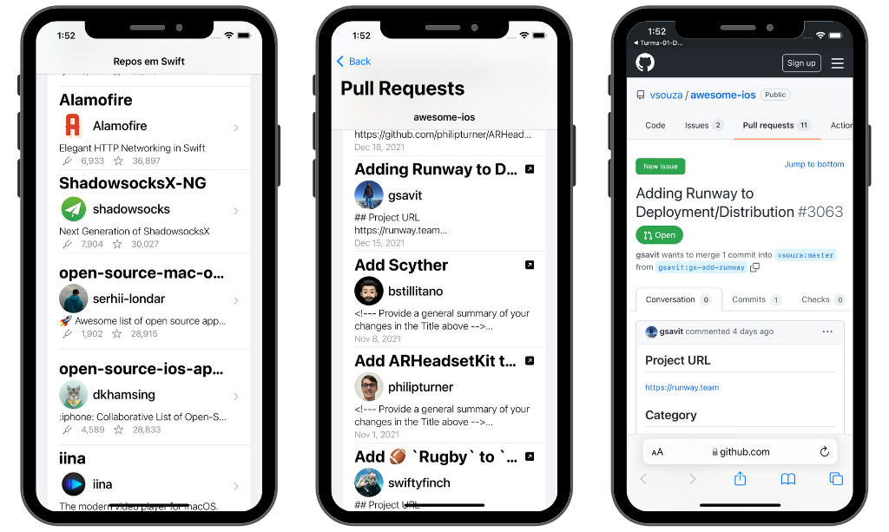

# Desafio iOS

## Criar um aplicativo para consultar a API do GitHub ##
Criar um aplicativo para consultar a API do GitHub e trazer os repositórios mais populares de Swift.

## O que será avaliado:
- Qualidade do código.
- Adoção de boas práticas recomendadas pela Apple no uso das APIs e Human Interface Guidelines.
- Funcionamento do produto entregue.

### Requisitos
- Lista de repositórios. Exemplo de chamada na API : https://api.github.com/search/repositories?q=language:Swift&sort=stars&page=1    
- Paginação na tela de lista, com endless scroll / scroll infinito (incrementando o parâmetro page).    
- Cada repositório deve exibir Nome do repositório, Descrição do Repositório, Nome / Foto do autor, Número de Stars, Número de Forks
- Ao tocar em um item, deve levar a lista de Pull Requests do repositório
- Pull Requests de um repositório. Exemplo de chamada na API: https://api.github.com/repos/<criador>/<repositório>/pulls
- Cada item da lista deve exibir Nome / Foto do autor do PR, Título do PR, Data do PR e Body do PR
- Ao tocar em um item, deve abrir no browser a página do Pull Request em questão

### Telas

### A solução DEVE conter
-    Versão mínima do iOS : 13.0
-    Arquivo .gitignore
-    Usar Viewcode
-    Gestão de dependências no projeto. Ex: Cocoapods
-    Framework para Comunicação com API. Ex: Alamofire
-    Mapeamento json -> Objeto . Ex: ObjectMapper
    > Optei por não utilizar um Framework para a comunicação e para o mapeamento de objetos. Tendo em vista de que se tratava de requisições GET simples, o Swfit foi perfeitamente capaz em lidar com o mapeamento de dados e com as requisições.
-    Cache de Imagens. Ex SDWebImage 
-    Suporte devices a partir do iPhone 5s.
-    Desenvolvido em Swift 5+ e Xcode 13.1. 

### **Ganha + pontos se conter** ###
-    Persistir os dados no CoreData
-    Exibir os dados do CoreData caso o app esteja offline
-    Testes unitários no projeto. Ex: XCTests
-    Componentes customizados;
-    Fonte customizadas;
-    l10n;
-    App Universal , Ipad | Iphone | Landscape | Portrait (Size Classes)

### **Ganha ++ pontos se usar** ###
-    SwiftUI com Combine.

### Sugestões ###
As sugestões de bibliotecas fornecidas são só um guideline, sintam-se a vontade para usar diferentes e nos surpreenderem. 
O importante de fato é que os objetivos macros sejam atingidos.

### Processo de submissão ###
O candidato deverá implementar a solução e enviar um pull request para este repositório com a solução.
O processo de Pull Request funciona da seguinte maneira:
1. Candidato fará um fork desse repositório (não irá clonar direto!)

2. Fará seu projeto nesse fork.

3. Commitará e subirá as alterações para o SEU fork.

4. Pela interface do GitHub, irá enviar um Pull Request.

Se possível deixar o fork público para facilitar a inspeção do código.

**ATENÇÃO**
Não se deve tentar fazer o PUSH diretamente para ESTE repositório!

